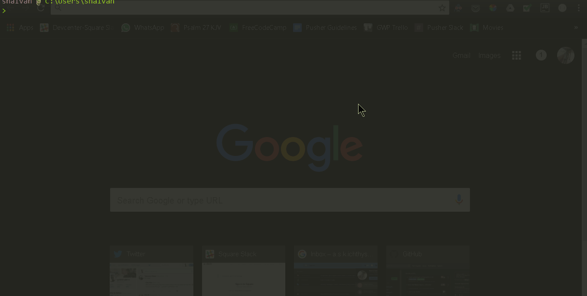

# shalvah

Shalvah (yes, me😝) on your command-line.



```bash
npm install -g shalvah

shalvah
```

Seriously, I got bored of websites and turned my personal site into a Node package. ¯\_(ツ)_/¯

There's still [a website](http://shalvah.me), though. It makes use of this package. Oh, and I wrote [a thing](https://dev.to/shalvah/i-was-bored-so-i-made-my-website-into-a-node-package-heres-how-2id3) about how I built this package.
